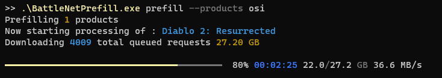
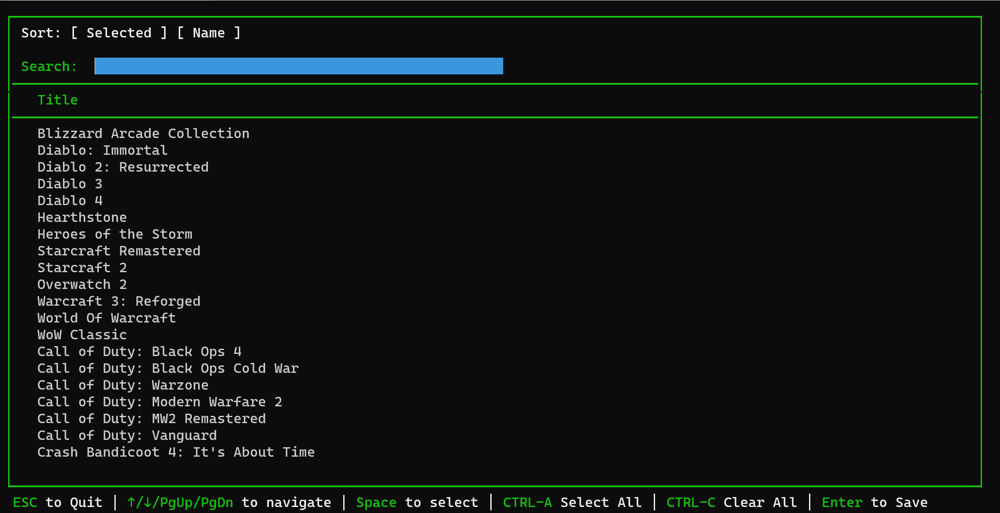
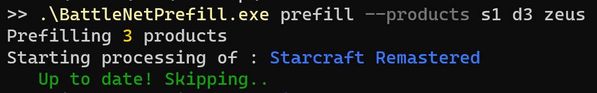
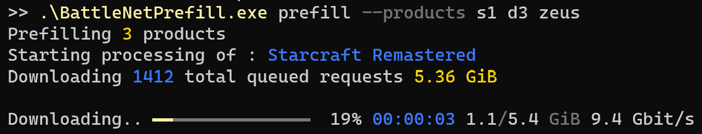
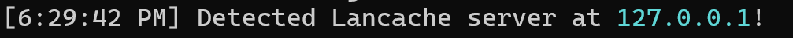
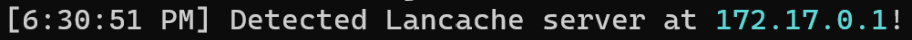
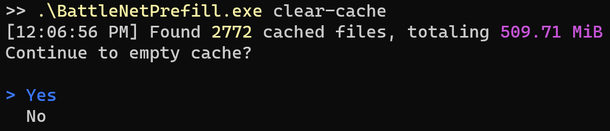
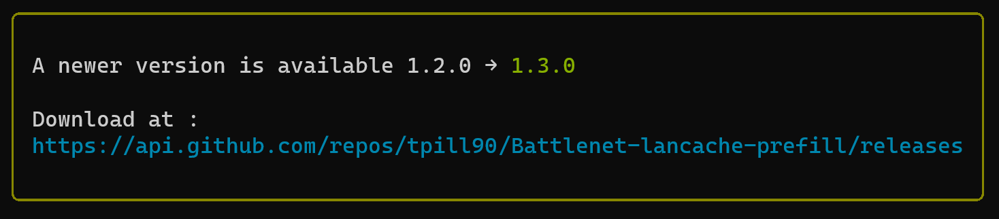

# battlenet-lancache-prefill

[](https://discord.com/invite/BKnBS4u)
[](https://ko-fi.com/Y8Y5DWGZN)


[](https://hub.docker.com/r/tpill90/battlenet-lancache-prefill)


Automatically fills a [Lancache](https://lancache.net/) with games from Battle.net, so that subsequent downloads for the same content will be served from the Lancache, improving speeds and reducing load on your internet connection.



Inspired by the [lancache-autofill](https://github.com/zeropingheroes/lancache-autofill) project for Steam games.

# Features
* Downloads specific games by product ID
* High-performance!  Downloads are significantly faster than using Battle.net, and can easily reach 10gbit/s or more!
* Game install writes no data to disk, so there is no need to have enough free space available.  This also means no unnecessary wear-and-tear to SSDs!
* Multi-platform support (Windows, Linux, MacOS, Arm64)
* No installation required! A completely self-contained, portable application.

# Table of contents
- [Initial Setup](#initial-setup)
- [Getting Started](#getting-started)
- [Frequently Asked Questions](#frequently-asked-questions)
- [Detailed Command Usage](#detailed-command-usage)
- [Updating](#updating)
- [Need Help?](#need-help)

# Initial Setup
1.  Download the latest version for your OS from the [Releases](https://github.com/tpill90/battlenet-lancache-prefill/releases) page.
2.  Unzip to a directory of your choice
3.  (**Linux / OSX Only**)  Give the downloaded executable permissions to be run with `chmod +x ./BattleNetPrefill`
4.  (**Windows Only - Optional**)  Configure your terminal to use Unicode, for much nicer looking UI output.
    - 
    - As the default console in Windows does not support UTF8, Windows Terminal should be installed from the [App Store](https://apps.microsoft.com/store/detail/windows-terminal/9N0DX20HK701), or [Chocolatey](https://community.chocolatey.org/packages/microsoft-windows-terminal).
    - Unicode on Windows is not enabled by default, however running the following will enable it if it hasn't already been enabled.
    - `if(!(Test-Path $profile) -or !(gc $profile).Contains("OutputEncoding")) { ac $profile "[console]::InputEncoding = [console]::OutputEncoding = [System.Text.UTF8Encoding]::new()";  & $profile; }`


# Getting Started

## Selecting what to prefill

> **Warning**
> This guide was written with Linux in mind.  If you are running **BattlenetPrefill** on Windows you will need to substitute `./BattlenetPrefill` with `.\BattlenetPrefill.exe` instead.

Prior to prefilling for the first time, you will have to decide which apps should be prefilled.  This will be done using an interactive menu, for selecting what to prefill from all of your currently owned apps. To display the interactive menu, run the following command
```powershell
./BattlenetPrefill select-apps
```

Once logged into Steam, all of your currently owned apps will be displayed for selection.  Navigating using the arrow keys, select any apps that you are interested in prefilling with **space**.  Once you are satisfied with your selections, save them with **enter**.



These selections will be saved permanently, and can be freely updated at any time by simply rerunning `select-apps` again at any time.

## Initial prefill

Now that a prefill app list has been created, we can now move onto our initial prefill run by using 
```powershell
./BattlenetPrefill prefill
```

The `prefill` command will automatically pickup the prefill app list, and begin downloading each app.  During the initial run, it is likely that the Lancache is empty, so download speeds should be expected to be around your internet line speed (in the below example, a 300mbit/s connection was used).  Once the prefill has completed, the Lancache should be fully ready to serve clients cached data.


## Updating previously prefilled games

Updating any previously prefilled games can be done by simply re-running the `prefill` command, with the same games specified as before.

**BattleNetPrefill** keeps track of which version of each game was previously prefilled, and will only re-download if there is a newer version of the game available.  
Any games that are currently up to date, will simply be skipped.




However, if there is a newer version of a game that is available, then **BattleNetPrefill** will re-download the game.  
Due to how Lancache works, this subsequent run should complete much faster than the initial prefill (example below used a 10gbit connection).
Any data that was previously downloaded, will be retrieved from the Lancache, while any new data from the update will be retrieved from the internet.



# Frequently Asked Questions

### Can I run BattleNetPrefill on the Lancache server?

You certainly can!  All you need to do is download **BattleNetPrefill** onto the server, and run it as you reguarly would!

If everything works as expected, you should see a message saying it found the server at `127.0.0.1`


Running from a Docker container on the Lancache server is also supported!  You should instead see a message saying the server was found at `172.17.0.1`


Running on the Lancache server itself can give you some advantages over running **BattleNetPrefill** on a client machine, primarily the speed at which you can prefill apps.  
Since there is no network transfer happening, the `prefill` should only be limited by disk I/O and CPU throughput.  
For example, using a **SK hynix Gold P31 2TB NVME** and running `prefill --force` on previously cached game yields the following performance 


# Detailed Command Usage

## prefill
Fills a Lancache by downloading the exact same files from Blizzard's CDN as the official Battle.Net client.  Expected initial download speeds should be the speed of your internet connection.

Subsequent runs of this command should be hitting the Lancache, and as such should be dramatically faster than the initial run.  

### -p|--products
If a list of products is supplied, only these products will be downloaded.  This parameter is ideally used when only interested in a small number of games.

### --all, --activision, --blizzard
Downloads multiple products, useful for prefilling a completely empty cache.  Can be combined with `--products`.

### --nocache
By default, **BattleNetPrefill** will cache copies of certain files on disk, in order to dramatically speed up future runs (in some cases 3X faster).  
These cache files will be stored in the `/Cache` directory in the same directory as **BattleNetPrefill**.
However, in some scenarios this disk cache can potentially take up a non-trivial amount of storage (~1gb), which may not be ideal for all use cases.

By running with the additional flag `--nocache`, **BattleNetPrefill** will no longer cache any files locally, at the expense of slower runtime.

### -f|--force
By default, **BattleNetPrefill** will keep track of the most recently prefilled product, and will only attempt to prefill if there it determines there a newer version available for download.  This default behavior will work best for most use cases, as no time will be wasted re-downloading files that have been previously prefilled.

Running with the flag `--force` will override this behavior, and instead will always run the prefill, re-downloading all files for the specified product.  This flag may be useful for diagnostics, or benchmarking network performance.

### --no-ansi 
Application output will be in plain text, rather than using the visually appealing colors and progress bars.  Should only be used if terminal does not support Ansi Escape sequences, or when redirecting output to a file.

## clear-cache
Deletes temporary cache files stored in the `/Cache` directory.  
These files are cached in order to dramatically speed up future `prefill` runs (in some cases 3X faster),
however in some cases this disk cache can potentially take up a non-trivial amount of storage (~1gb).  



These cache files will also build up over time, as newer versions of games are released, leaving unused cache data behind that will never be used again.

In the case that you would like to save disk space without having to constantly clear the cache, 
running `prefill` with the `--nocache` flag specified will prevent the cache files from being written in the first place.

### -y|--yes
Skips the prompt asking to clear the cache, and immediately begins clearing the cache.

# Updating
**BattleNetPrefill** will automatically check for updates, and notify you when an update is available :



To update:
1.  Download the latest version for your OS from the [Releases](https://github.com/tpill90/battlenet-lancache-prefill/releases) page.
2.  Unzip to the directory where **BattleNetPrefill** is currently installed, overwriting the previous executable.
3.  Thats it!  You're all up to date!

### Docker update:
sudo docker pull tpill90/battlenet-lancache-prefill:latest

# Need Help?
If you are running into any issues, feel free to open up a Github issue on this repository.

You can also find us at the [**LanCache.NET** Discord](https://discord.com/invite/BKnBS4u), in the `#battlenet-prefill` channel.

# Additional Documentation
* [Developer's guide](/docs/Development.md)

# External Docs
* https://wowdev.wiki/TACT
* https://github.com/d07RiV/blizzget/wiki

## Acknowledgements

- https://github.com/Marlamin/BuildBackup
- https://github.com/WoW-Tools/CASCExplorer
- https://github.com/d07RiV/blizzget
